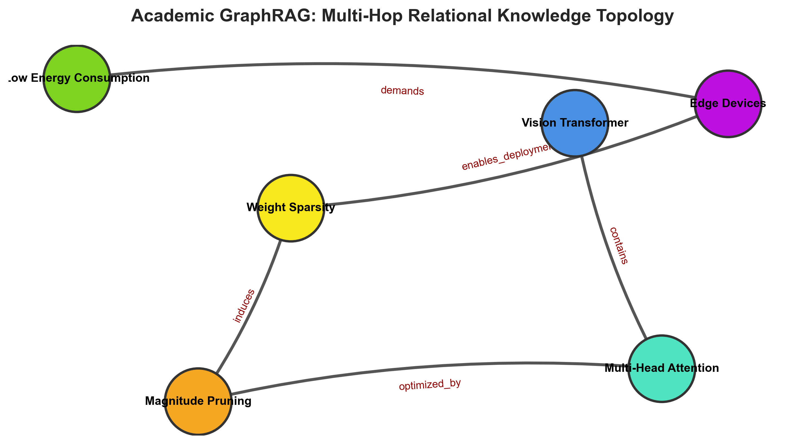

# Academic GraphRAG: Hybrid Knowledge Graph & Dense Vector Retrieval

[](https://github.com/sinarahmani82/academic-graph-rag/actions/workflows/ci.yml)
[](#)
[](#)
[](#)
[](#)

A modular, self-contained **Hybrid GraphRAG** framework engineered for multi-hop scientific literature discovery. It couples directed relational knowledge graphs with dense semantic vector retrieval to mitigate hallucinations and resolve complex inter-paper reasoning chains.

---

### 🔬 Motivation: Why Graph-Augmented RAG?
Conventional vector-only Retrieval-Augmented Generation (Naive RAG) performs isolated semantic chunk matching. Consequently, it fundamentally fails on **multi-hop scientific inquiries** requiring relational inference (e.g., tracing how architectural compression connects to edge-device hardware latency).

This framework bridges that gap:
1. **Dense Vector Search:** Fast retrieval of semantically proximal textual evidence using `all-MiniLM-L6-v2`.
2. **Relational Graph Traversal:** Directed multi-hop discovery using `NetworkX` to unearth causal dependencies between disparate scientific concepts.

---

### 📂 Architecture & Pipeline

```text
academic-graph-rag/
│
├── .github/workflows/
│   └── ci.yml               # Automated CI pipeline
├── src/
│   ├── __init__.py
│   ├── graph_builder.py     # Directed Knowledge Graph & multi-hop traversal
│   ├── vector_retriever.py  # Dense vector indexing & cosine similarity
│   └── hybrid_rag.py        # Context fusion & multi-hop reasoning engine
├── tests/
│   ├── __init__.py
│   └── test_graph_rag.py    # Unit tests for graph discovery and retrieval
├── requirements.txt         # Dependencies
├── main.py                  # End-to-end scientific QA demonstration
└── README.md
```

---

### 📊 Demonstration & Multi-Hop Output

When queried with a complex multi-concept research question:
> *"How does pruning attention mechanisms facilitate edge deployment?"*

The system extracts both semantic contexts and structured relational paths:

<div align="center">
  
  <p><em>Figure 1: Graph traversal topology resolving multi-hop relationships between architectural concepts and hardware constraints.</em></p>
</div>

| Hop # | Discovered Knowledge Path | Context Type |
|---|---|---|
| **1** | `Vision Transformer --(contains)--> Multi-Head Attention` | Architectural Subcomponent |
| **2** | `Multi-Head Attention --(optimized_by)--> Magnitude Pruning` | Optimization Strategy |
| **3** | `Magnitude Pruning --(induces)--> Weight Sparsity` | Structural Consequence |
| **4** | `Weight Sparsity --(enables_deployment_on)--> Edge Devices` | Deployment Target |
| **5** | `Edge Devices --(demands)--> Low Energy Consumption` | Hardware Constraint |
---

### 🛠️ How to Reproduce

1. **Clone repository:**
   ```bash
   git clone https://github.com/sinarahmani82/academic-graph-rag.git
   cd academic-graph-rag
   ```

2. **Install dependencies:**
   ```bash
   pip install -r requirements.txt
   ```

3. **Execute unit tests:**
   ```bash
   python -m pytest tests/
   ```

4. **Run demonstration pipeline:**
   ```bash
   python main.py
   ```
